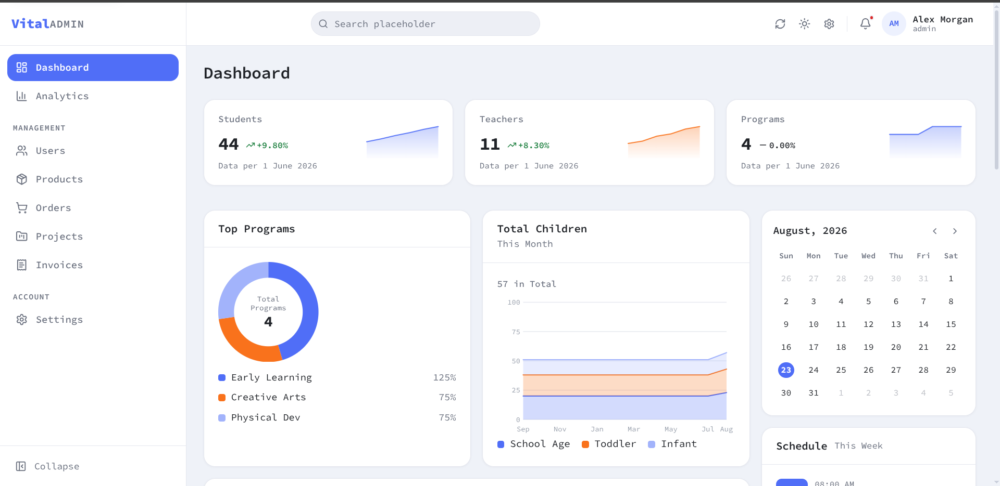

# Vital Admin Template
   
Vital Admin is a **free, open-source React admin template** built with **TypeScript** and **Vite**. It provides a production-oriented foundation for **responsive admin dashboards**, SaaS applications, CRM systems, analytics platforms, ecommerce dashboards, and internal tools.

Unlike templates that hard-wire their UI to fake data, Vital Admin follows a backend-oriented architecture: every feature talks to the API through its own service module, so you can replace the bundled mock API with your real backend **without rewriting the UI**.

[](./LICENSE)
[](https://www.typescriptlang.org/)
[](https://react.dev/)
[](https://vite.dev/)

**[Try the live demo](https://vital-admin-template.vercel.app/)** 

## Screenshots



The screenshot above shows the dashboard home: KPI cards with sparklines, charts, a program overview, and the collapsible sidebar navigation — all theme-aware and responsive from desktop down to mobile.

## Live Demo

A fully working deployment runs at **https://vital-admin-template.vercel.app/** using the built-in mock API.

Sign in with the seeded demo account shown on the login screen (`admin@vital.dev` / `admin123`). No environment variables or backend required.

## Features

- **Dashboard** — KPI cards with sparklines, revenue charts, activity feed, quick actions, calendar widget
- **Users** — searchable/sortable/paginated list, create & edit dialog, delete confirmation, detail page
- **Products** — catalog CRUD with categories, inventory badges, price formatting
- **Orders** — fulfillment + payment status management on a detail page with line items and totals
- **Projects & invoices** — progress tracking plus invoice status transitions
- **Analytics** — URL-synced date ranges, per-metric deltas, area/bar/donut charts
- **Notifications** — dropdown panel with unread state and mark-as-read
- **Auth scaffolding** — session provider, protected routes, global 401 handling, role-aware UI
- **Settings** — profile form with server-side field errors, light/dark/system theme picker
- **Mock API** — MSW-powered server with seeded data, shared Zod contracts, realistic error envelopes

## Tech Stack

| Concern      | Choice                                       |
| ------------ | -------------------------------------------- |
| Build        | Vite                                         |
| UI           | React 19, plain CSS with design tokens       |
| Routing      | react-router v7 (lazy routes, breadcrumbs)   |
| Server state | TanStack Query v5                            |
| Forms        | Custom `useForm` hook + Zod schemas          |
| Charts       | Hand-rolled SVG (zero chart dependencies)    |
| Mock API     | MSW v2 with a seeded JSON database           |
| Validation   | Zod v4 (shared by forms **and** mock server) |
| Testing      | Vitest + Testing Library + msw/node          |

No UI framework, no CSS framework, no form library, no chart library — every layer is small enough to read and own.

## Architecture

The differentiator of this React admin panel starter is its strict, one-directional layering:

```
Component → Hook → Service → API Client → Mock API (or your real backend)
```

- **Components** never import mock data or call HTTP directly.
- **Hooks** wrap TanStack Query for caching, invalidation, and optimistic updates.
- **Services** are the only place a feature touches HTTP.
- **Zod schemas** validate request payloads on both the form and the (mock) server, so client and backend share one contract.

Because the last hop behind the API client is disposable, connecting your production API is a configuration change, not a rewrite.

## Mock API

The bundled mock server (MSW v2) seeds users, products, orders, projects, invoices, notifications, and analytics so every page works out of the box. It supports filtering, sorting, pagination, search, auth tokens, latency simulation, and consistent error responses:

```jsonc
{
  "error": {
    "code": "validation_error",
    "message": "Please fix the highlighted fields.",
    "fields": { "email": "A user with this email already exists." },
  },
}
```

## Backend Integration

Replacing the mock API takes three steps:

1. **Point the client at your backend** — set `VITE_API_URL=https://your-api.com` and `VITE_ENABLE_MOCK_API=false`.
2. **Match the response contract** (or adapt the services):
   - Lists: `{ "data": [...], "meta": { "page", "pageSize", "total", "totalPages" } }`
   - Single resources: `{ "data": { ... } }`
   - Errors: `{ "code", "message", "fields"? }`
   - Auth: `POST /auth/login` → `{ user, token }`, then `Authorization: Bearer <token>`
3. **Delete the mock layer when confident** — remove `src/data/mock-server/`, `src/data/db/`, `public/mockServiceWorker.js`, and the `enableMocking()` block in `src/main.tsx`.

Request validation lives in `src/models/schemas.ts`; a real backend should enforce the same constraints. For authentication, swap the four calls in `src/services/auth/auth.service.ts` for your identity provider — the session provider, route guards, and 401 handling stay untouched.

## Project Structure

```
src/
├── app/                  # Providers, router, guards
├── components/
│   ├── ui/               # Design-system primitives (Button, Dialog, Table…)
│   ├── layout/           # AdminLayout, Sidebar, menus, PageHeader
│   ├── charts/           # Dependency-free SVG charts
│   └── …                 # Toasts, badges, form helpers
├── config/               # Runtime config, navigation registry
├── data/
│   ├── db/               # Seeded JSON records (generated — do not hand-edit)
│   └── mock-server/      # MSW handlers + in-memory database
├── features/             # One folder per domain, e.g.:
│   └── users/
│       ├── users.service.ts    # The ONLY file that talks HTTP
│       ├── hooks/use-users.ts  # TanStack Query hooks
│       ├── components/         # Feature-specific components
│       └── pages/              # Route-level pages
├── hooks/                # Cross-feature hooks (useForm, debounce…)
├── lib/                  # Pure helpers (format, errors, query keys)
├── models/               # Types + Zod request schemas (shared contracts)
├── services/             # API client, auth service, storage
├── styles/               # Design tokens + global CSS
└── types/                # Generic API types (Paginated, ListQuery…)
```

## Installation

```bash
git clone https://github.com/Miftah-Fentaw/React-admin-template.git
cd React-admin-template
npm install
```

Then start the dev server:

```bash
npm run dev      # http://localhost:5173
```

## Development

| Script              | What it does                                 |
| ------------------- | -------------------------------------------- |
| `npm run dev`       | Start the dev server                         |
| `npm run build`     | Type-check then production build             |
| `npm run preview`   | Preview the production build                 |
| `npm run lint`      | ESLint                                       |
| `npm run typecheck` | `tsc -b`                                     |
| `npm run format`    | Prettier write                               |
| `npm run test`      | Vitest in watch mode                         |
| `npm run test:run`  | Vitest once (CI)                             |
| `npm run seed`      | Regenerate the mock database (`src/data/db`) |

See `.env.example` for runtime configuration (`VITE_API_URL`, `VITE_ENABLE_MOCK_API`).

## Testing

- **Unit** — pure helpers and schemas (`tests/*.test.ts`)
- **Components** — Testing Library (`tests/Button.test.tsx`)
- **Services** — real MSW handlers under `msw/node`, pinning the API contract (`tests/users.service.test.ts`)

Run everything with `npm run test:run`.

## Deployment

The template deploys anywhere that serves static assets with SPA fallback routing. A `vercel.json` with the required rewrites is included, so `vercel deploy` works out of the box. Set your real API URL via `VITE_API_URL` at build time once you move past the mock API.

## Contributing

Contributions are welcome! See [CONTRIBUTING.md](./CONTRIBUTING.md) for local setup, verification gates, and pull-request conventions.

## License

[MIT](./LICENSE) — free for personal and commercial use.
